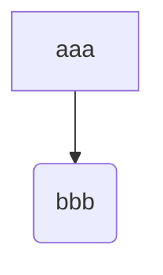

# Workflow Diagram

Key considerations:

  - "Environment Variables"
  - Ansible
  - Cluster Customizations
  - Management Cluster
  - OpenStack Client
  - OpenTofu
  - `clouds.yaml`

```mermaid
flowchart TD
    A[aaa] --> B(bbb)
```
