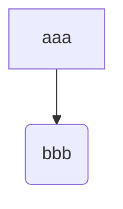

# Workflow Diagram

Key considerations:

  - Ansible
  - Cluster Configuration
  - Environment Variables
  - Management Cluster
  - OpenStack Client
  - OpenTofu (Terraform)

Related Configuration Files:

  - `clouds.yaml`

