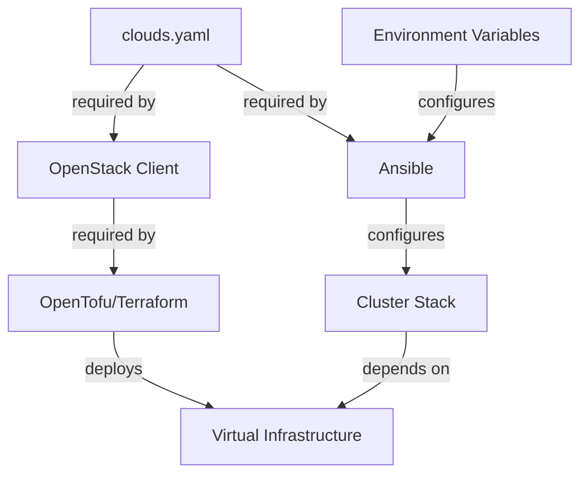

# Workflow Diagram

### Key Components

  - Ansible
  - Environment Variables
  - Cluster Stack
  - OpenStack Client
  - OpenTofu (Terraform)
  - Virtual Infrastructure

### Configuration Files

  - `clouds.yaml`

### Mermaid Diagram

